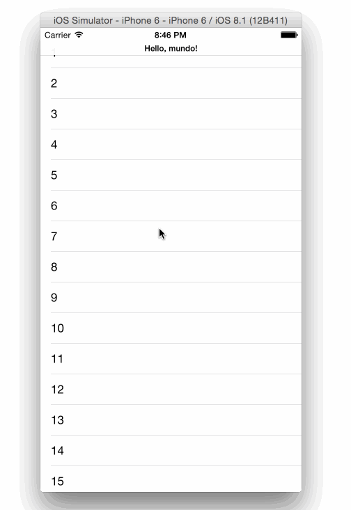

A Swift `UINavigationController` subclass to add a collapsable `UINavigationBar` when scrolling inside the top view controller.



## Usage

Use a `PVSCollapsibleBarNavigationController` instead of a `UINavigationController` in your project.
In your view controller that contains scrollable content (i.e. a `UIScrollView` or something that contains one, like a `UITableView`) implement the UIScrollViewDelegate:

```
class TestViewController: UIViewController, UITableViewDataSource, UITableViewDelegate, UIScrollViewDelegate {
```

Then, inside your view controller, implement the following delegate method, and call `pvs_collapsibleBarScrollViewDidScroll` passing in the `UIScrollView` instance:

```
//#pragma - mark UIScrollViewDelegate

func scrollViewDidScroll(scrollView: UIScrollView) {
    self.navigationController?.pvs_collapisbleBarScrollViewDidScroll(scrollView)
}
```

That's it!
If needed, play with the globals inside `PVSCollapsibleBarNavigationController` to change the speed of the collapse and the title size.
